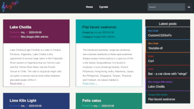

# Sonate - Template for typecho

A colourful template for [typecho](http://typecho.org)

## Install

+ Clone repo

```sh
cd <PATH-TO-TYPECHO>/usr/themes
git clone https://github.com/insomnux/typecho-sonate.git
```

+ Activate theme in admin panel
`http://my-typecho-site.com/admin/themes.php`

+ Select logo image and background image
`http://my-typecho-site.com/admin/options-theme.php`

## Screenshot




+ Demo:

[http://sonate.forloops.xyz/](http://sonate.forloops.xyz/)

## Changelog

20200314
Changed comment form styling
Added option for custom background

20200309
Init commit
